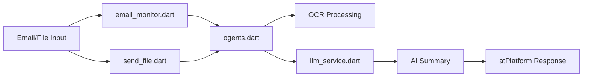

# ogents - Intelligent File Processing with atPlatform

An AI agent with an atSign that automatically processes file notifications and provides intelligent summaries using LLM services via the atPlatform. Now includes comprehensive email monitoring with IMAP support for automated PDF processing from email attachments.

## 🌐 What is the atPlatform?

The **atPlatform** is a revolutionary networking infrastructure that fundamentally changes how applications communicate online. Unlike traditional client-server architectures, the atPlatform enables **true peer-to-peer communication** with enterprise-grade security built-in.

### 🔑 Key atPlatform Benefits

#### **1. Zero Trust Security by Design**
- **End-to-End Encryption**: All data is encrypted before leaving your device using AES-256
- **No Central Data Storage**: Your data never sits on third-party servers
- **Cryptographic Identity**: Each atSign (@username) has unique RSA-2048 cryptographic keys
- **Perfect Forward Secrecy**: Keys rotate automatically for maximum security

#### **2. True Peer-to-Peer Communication**
- **Direct Device-to-Device**: Applications communicate directly without intermediaries
- **Real-time Notifications**: Instant, secure message delivery across the globe
- **Decentralized Architecture**: No single point of failure or control
- **Global Reach**: Works across networks, firewalls, and NAT seamlessly

#### **3. Privacy-First Design**
- **You Own Your Data**: Complete control over who accesses what information
- **No Surveillance**: No central authority can monitor your communications
- **Consent-Based Sharing**: Granular permissions for every piece of data
- **GDPR Compliant**: Built-in privacy compliance by design

#### **4. Developer-Friendly**
- **Simple APIs**: Easy integration with existing applications
- **Cross-Platform**: Works on mobile, web, desktop, and IoT devices
- **Scalable**: From personal apps to enterprise solutions
- **Open Source**: Transparent, auditable codebase

### 🆚 atPlatform vs Traditional Approaches

| Feature | Traditional Client-Server | atPlatform |
|---------|---------------------------|------------|
| **Data Storage** | Centralized servers | Your devices only |
| **Security** | Perimeter-based | End-to-end encryption |
| **Privacy** | Server owner controls | You control everything |
| **Communication** | Through intermediaries | Direct peer-to-peer |
| **Scalability** | Server capacity limits | Distributed by design |
| **Trust Model** | Trust the server | Zero trust required |
| **Data Ownership** | Platform owns your data | You own your data |

## 🎯 Why ogents Uses atPlatform

Traditional file processing systems require uploading sensitive documents to cloud servers, creating security and privacy risks. **ogents** leverages the atPlatform to solve these fundamental problems:

### **🔒 Secure Document Processing**
- Documents are encrypted before transmission using military-grade encryption
- Processing happens on trusted devices you control
- No sensitive data stored in the cloud or on third-party servers
- Perfect for confidential business documents, legal files, and personal data

### **🤝 Peer-to-Peer AI Collaboration**
- Send files directly to AI processing agents without cloud storage
- Receive summaries through secure, encrypted channels
- Scale processing across multiple trusted agents
- Maintain complete audit trails of all document interactions

### **📱 Real-Time Updates Without Servers**
- Live notifications when files are processed
- Instant updates across all connected devices
- No polling, webhooks, or delayed updates
- WebSocket-like functionality, but completely secure and decentralized

### **🏢 Enterprise-Ready Security**
- No vendor lock-in or dependency on cloud providers
- Meets compliance requirements (GDPR, HIPAA-ready architecture)
- Complete data sovereignty - your data never leaves your control
- Audit trails for every file interaction and permission change

## 📋 Features

- **📧 Email Monitoring**: Direct IMAP integration + directory monitoring for automated PDF processing
- **🔔 Notification-Based**: Triggers automatically when files are sent via atPlatform
- **📁 Multi-Format Support**: Handles text files, documents, archives, PDFs, and images
- **🧠 AI Summarization**: Integrates with LLM services (Ollama) for intelligent content analysis
- **🔒 Secure**: End-to-end encryption via atSign messaging
- **🌐 URL Support**: Can process files from URLs as well as local files
- **👁️ Advanced OCR**: Full multi-page PDF text extraction using Tesseract OCR
- **📊 Archive Support**: Automatically extracts and processes ZIP/TAR archives
- **⚡ Real-time**: Instant processing and response via atPlatform notifications
- **📨 IMAP Integration**: Connect to Gmail, Outlook, Yahoo, and custom email servers
- **🔍 Smart Processing**: Intelligent routing between OCR and LLM based on content type
- **🧠 AI Summarization**: Integrates with LLM services (Ollama) for intelligent content analysis
- **🔒 Secure**: End-to-end encryption via atSign messaging
- **🌐 URL Support**: Can process files from URLs as well as local files
- **�️ OCR Capabilities**: Extracts text from PDFs and images using Tesseract OCR
- **📊 Archive Support**: Automatically extracts and processes ZIP/TAR archives
- **⚡ Real-time**: Instant processing and response via atPlatform notifications

## 🏗️ ogents Architecture with atPlatform

ogents demonstrates the power of atPlatform's peer-to-peer architecture through a secure, decentralized file processing system:

```
┌─────────────────┐    encrypt    ┌─────────────────┐    process    ┌─────────────────┐
│   File Sender   │──────────────▶│  File Agent     │──────────────▶│   LLM Service   │
│   (@sender)     │  atPlatform   │  (@processor)   │               │   (@llm)        │
└─────────────────┘               └─────────────────┘               └─────────────────┘
         │                                 │                                 │
         │ encrypted notifications         │ secure notifications            │
         ▼                                 ▼                                 │
┌─────────────────┐               ┌─────────────────┐               ◀─────────┘
│  Web Dashboard  │               │   Local Database│               
│   (@viewer)     │               │   (SQLite only) │               
└─────────────────┘               └─────────────────┘               
```

### **atPlatform Integration Points:**

1. **Secure File Transmission** 
   - Files encrypted with recipient's public key before sending
   - Direct peer-to-peer delivery without cloud storage
   - Automatic key exchange and verification

2. **Real-Time Notifications**
   - Instant delivery when files are processed
   - No polling or server dependencies
   - Cross-device synchronization

3. **Identity-Based Access Control**
   - Each component has a unique atSign identity
   - Cryptographic authentication for all communications
   - Granular permissions per interaction

4. **Zero-Server Architecture**
   - No central servers storing your documents
   - Processing happens on devices you control
   - Complete data sovereignty maintained

## Architecture

The system consists of four main components:

1. **File Agent** (`ogents`): Receives file notifications, downloads files, and orchestrates the summarization process
## 🏗️ System Architecture

The ogents system consists of four main components that work together:

1. **Main Agent** (`ogents.dart`): Core file processing agent with OCR and atPlatform integration
2. **Email Monitor** (`email_monitor.dart`): Comprehensive email monitoring with IMAP + directory support  
3. **LLM Service** (`llm_service.dart`): AI-powered text analysis with Ollama integration
4. **File Sender** (`send_file.dart`): Command-line utility for sending files to agents

📖 **[Complete System Architecture Guide →](docs/SYSTEM_ARCHITECTURE.md)**

For detailed information about each binary, system workflows, configuration options, and integration examples, see the comprehensive system architecture documentation.

## 🚀 Quick Start

### Prerequisites

- Dart SDK 3.8.1 or higher
- Active atSign from [my.atsign.com](https://my.atsign.com)
- **Tesseract OCR**, **ImageMagick**, and **Ghostscript** for PDF processing

### Installing OCR Dependencies

**macOS:**
```bash
# Install required OCR tools
brew install tesseract imagemagick ghostscript

# Verify installations
tesseract --version
magick --version
gs --version
```

**Linux (Ubuntu/Debian):**
```bash
# Install required OCR tools
sudo apt-get update
sudo apt-get install tesseract-ocr imagemagick ghostscript

**Ubuntu/Debian:**
```bash
sudo apt update
sudo apt install tesseract-ocr imagemagick ghostscript
```

**Windows:**
```bash
# Install via Chocolatey
choco install tesseract imagemagick ghostscript
```

### Installation

```bash
git clone https://github.com/cconstab/ogents.git
cd ogents
dart pub get

# Generate database code (REQUIRED for clean installations!)
dart run build_runner build
```

## 🔄 How It Works



**Simple Workflow:**
1. **Input**: Email attachments or manual file sends
2. **Processing**: OCR extraction + AI analysis  
3. **Output**: Intelligent summaries via atPlatform

## ⚡ Quick Start

### Prerequisites

- **Dart SDK 3.8.1 or higher**
- **Active atSign** from [my.atsign.com](https://my.atsign.com)
- **Tesseract OCR**, **ImageMagick**, and **Ghostscript** for PDF processing

### Installing OCR Dependencies

**macOS:**
```bash
# Install required OCR tools
brew install tesseract imagemagick ghostscript

# Verify installations
tesseract --version
magick --version
gs --version
```

**Linux (Ubuntu/Debian):**
```bash
# Install required OCR tools
sudo apt-get update
sudo apt-get install tesseract-ocr imagemagick ghostscript

# Verify installations
tesseract --version
magick --version
gs --version
```

**Windows:**
```bash
# Install via Chocolatey
choco install tesseract imagemagick ghostscript

# Verify installations
tesseract --version
magick --version
gs --version
```

### Installation & Setup

```bash
# 1. Clone the repository
git clone https://github.com/cconstab/ogents.git
cd ogents

# 2. Install Dart dependencies
dart pub get

# 3. Generate database code (REQUIRED!)
dart run build_runner build

# 4. Setup your atSign credentials
dart run at_onboarding_cli -a @your_atsign
```

### 1. Setup atSign
```bash
dart run at_onboarding_cli -a @your_atsign
```

### 2. Start LLM Service
```bash
# Simple mode (built-in summarizer)
dart run bin/llm_service.dart -a @llm_service -n ogents -t simple

# Ollama mode (requires Ollama running)  
dart run bin/llm_service.dart -a @llm_service -n ogents -t ollama \
  --ollama-url http://localhost:11434 --ollama-model llama3.2
```

### 3. Start File Agent
```bash
dart run bin/ogents.dart -a @agent -l @llm_service -n ogents
```

### 4. Send a File
```bash
dart run bin/send_file.dart -a @sender -g @agent -f document.pdf -n ogents
```

### 5. Email Monitoring (Optional)
```bash
# IMAP mode
dart run bin/email_monitor.dart -a @sender -g @agent -n ogents \
  --imap-server imap.gmail.com --email user@gmail.com --password app_pass --ssl

# Directory mode  
dart run bin/email_monitor.dart -a @sender -g @agent -n ogents -e ./email_folder
```

## 🌟 atPlatform Advantages in Action

### **Traditional File Processing Service:**
```
Your Document → Upload to Cloud → AI Processing → Results in Cloud Database
❌ Document stored on vendor servers
❌ Processing history tracked by third parties  
❌ Vendor lock-in and dependency
❌ Privacy concerns and compliance issues
❌ Security risks from centralized storage
❌ Potential data breaches affecting millions
```

### **ogents with atPlatform:**
```
Your Document → Encrypted P2P → AI Processing → Results Direct to You
✅ Document never stored centrally
✅ Private processing history under your control
✅ No vendor lock-in - you own the infrastructure
✅ Complete privacy control and GDPR compliance
✅ Enterprise-grade security with zero-trust architecture  
✅ Immune to large-scale data breaches
```

### **Real-World Use Cases Enabled by atPlatform:**

#### **🏢 Business & Enterprise**
- **Confidential Contract Review**: Legal documents processed without cloud exposure
- **Financial Document Analysis**: Bank statements and reports stay secure
- **HR Document Processing**: Employee records processed privately
- **Board Meeting Minutes**: Sensitive discussions summarized securely

#### **🏥 Healthcare & Legal**
- **Patient Document Processing**: HIPAA-compliant without cloud storage
- **Legal Brief Summarization**: Attorney-client privilege maintained
- **Medical Record Organization**: Patient data never leaves authorized devices
- **Compliance Documentation**: Regulatory requirements met through design

#### **🎓 Education & Research**
- **Academic Paper Review**: Research data stays with institutions
- **Student Assignment Processing**: Educational records remain private
- **Grant Application Analysis**: Proprietary research protected
- **Thesis and Dissertation Support**: Intellectual property secured

## 📚 Documentation

- **[📖 Complete System Architecture](docs/SYSTEM_ARCHITECTURE.md)** - Detailed binary guide with Mermaid diagrams
- **[📧 Email Monitoring Setup](docs/EMAIL_MONITOR_ENHANCED.md)** - Gmail, Outlook, Yahoo configuration
- **[📁 Example Files](docs/examples/)** - Sample data and documents for testing

## 🔧 Key Features Highlighted

### Advanced Email Processing
- **Direct IMAP Integration**: Connect to Gmail, Outlook, Yahoo
- **Size Validation**: 8MB limit prevents buffer overflow  
- **Auto-Archival**: Processed files moved to timestamped folders
- **Provider Support**: All major email services with app password support

### Intelligent OCR Processing
- **Multi-page PDFs**: Complete text extraction up to 10 pages
- **High-resolution**: 300 DPI conversion for optimal accuracy
- **Smart Routing**: OCR + LLM analysis or direct text return
- **Format Support**: PDF, JPG, PNG, BMP, TIFF, GIF

### AI-Powered Analysis
- **Ollama Integration**: Local LLM models (llama3.2, etc.)
- **Built-in Summarizer**: Rule-based analysis for quick processing
- **Content Intelligence**: Automatic format detection and routing
- **Multi-modal**: Text, OCR, and archive processing

### Secure Communication
- **atPlatform**: End-to-end encrypted messaging
- **No Central Servers**: Decentralized architecture
- **Private Keys**: Local authentication and key management
Complete email monitoring system for automated PDF processing:
- **IMAP Integration**: Direct connection to email accounts
- **Directory Monitoring**: Watch local folders for new PDFs  
## 🎯 Example Usage

### Complete System Workflow
```bash
# 1. Start LLM Service
dart run bin/llm_service.dart -a @llm -n ogents -t simple

# 2. Start File Agent  
dart run bin/ogents.dart -a @agent -l @llm -n ogents

# 3. Send a File
dart run bin/send_file.dart -a @user -g @agent -f document.pdf -n ogents

# 4. Optional: Email Monitoring
dart run bin/email_monitor.dart -a @user -g @agent -n ogents \
  --imap-server imap.gmail.com --email user@gmail.com --password app_pass --ssl
```

## 📋 Supported File Formats

| Format | Extensions | Processing |
|--------|------------|------------|
| **Text** | `.txt`, `.md`, `.csv`, `.json`, `.xml` | Direct processing |
| **PDFs** | `.pdf` | Multi-page OCR (10 pages max) |  
| **Images** | `.jpg`, `.png`, `.bmp`, `.tiff`, `.gif` | OCR text extraction |
| **Archives** | `.zip`, `.tar`, `.gz` | Extract and process contents |
| **URLs** | Any web link | Download and process |

**Size Limit**: 8MB maximum to prevent buffer overflow

## 🔧 Troubleshooting

**Common Issues:**
- **Files not processing**: Check 8MB size limit and file format support
- **Email connection fails**: Verify IMAP settings and use app passwords for Gmail/Yahoo  
- **OCR errors**: Ensure Tesseract, ImageMagick, and Ghostscript are installed
- **atSign issues**: Verify keys are activated and network connectivity

📖 **[Complete troubleshooting guide →](docs/SYSTEM_ARCHITECTURE.md#error-handling-and-monitoring)**

## 📄 License

This project is licensed under the BSD 3-Clause License - see the [LICENSE](LICENSE) file for details.

## 🔗 Related Projects & Resources

## 🔧 Troubleshooting

### Database Errors on Clean Installation

If you see database-related errors when first running `ogents`, ensure you've run the code generation step:

```bash
# Generate required database files
dart run build_runner build
```

This creates the `lib/src/database_service.g.dart` file which contains the generated database code needed by the Drift ORM.

### Common Issues

**"NoSuchMethodError" or database connection errors:**
- Run `dart run build_runner build` to generate database code
- Ensure SQLite is available on your system
- Check that all dependencies are installed with `dart pub get`

**PDF processing failures:**
- Verify Tesseract OCR is installed: `tesseract --version`
- Verify ImageMagick is installed: `magick --version` 
- Verify Ghostscript is installed: `gs --version`

**Email monitoring not detecting PDFs:**
- Check IMAP settings and credentials
- Ensure emails contain PDF attachments
- Review debug output for processing details

---

### **atPlatform Ecosystem**
- **[atPlatform Website](https://atsign.com)** - Get your free atSign and learn about the platform
- **[Developer Documentation](https://docs.atsign.com)** - Complete technical documentation
- **[atPlatform GitHub](https://github.com/atsign-foundation)** - Open source repositories
- **[Community Discord](https://discord.gg/atsign)** - Join the developer community

### **Technical Deep Dives**
- **[atPlatform Security Model](https://docs.atsign.com/security)** - Cryptographic architecture details
- **[Peer-to-Peer Networking Guide](https://docs.atsign.com/p2p)** - How P2P communication works
- **[Building atPlatform Apps](https://docs.atsign.com/tutorials)** - Developer tutorials and examples
- **[atSign Registration](https://my.atsign.com)** - Get your free atSign identity

### **Related ogents Projects**
- **[ogentic](https://github.com/cconstab/ogentic)** - Chat application with LLM integration using atPlatform
- **[at_client_sdk](https://github.com/atsign-foundation/at_client_sdk)** - Dart SDK for atPlatform development

---

## 🔮 The Future is Decentralized

The atPlatform represents a fundamental shift toward a more secure, private, and user-controlled internet. **ogents** demonstrates how traditional cloud-based services can be reimagined with true peer-to-peer architecture, giving users complete control over their data while maintaining all the functionality they expect.

**Key Benefits Realized:**
- ✅ **No Cloud Lock-in**: Your data, your devices, your control
- ✅ **Enterprise Security**: Military-grade encryption without enterprise costs  
- ✅ **Privacy by Design**: GDPR compliance built into the architecture
- ✅ **Global Scale**: Peer-to-peer networking that works anywhere
- ✅ **Developer Friendly**: Simple APIs that hide complex cryptography

**Ready to experience the future of secure document processing?** [Get your free atSign](https://my.atsign.com) and start building with ogents today!

---

**🚀 Ready to process documents with AI? Start with the [Quick Start](#-quick-start) guide!**

*Built with ❤️ using the atPlatform - Where privacy and security are not optional features, but fundamental design principles.*
