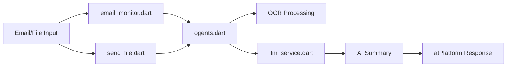

# ogent Agent with atSign File Processing & Email Monitoring

An AI agent with an atSign that automatically processes file notifications and provides intelligent summaries using LLM services via the atPlatform. Now includes comprehensive email monitoring with IMAP support for automated PDF processing from email attachments.

## 📋 Features

- **📧 Email Monitoring**: Direct IMAP integration + directory monitoring for automated PDF processing
- **🔔 Notification-Based**: Triggers automatically when files are sent via atPlatform
- **📁 Multi-Format Support**: Handles text files, documents, archives, PDFs, and images
- **🧠 AI Summarization**: Integrates with LLM services (Ollama) for intelligent content analysis
- **🔒 Secure**: End-to-end encryption via atSign messaging
- **🌐 URL Support**: Can process files from URLs as well as local files
- **👁️ Advanced OCR**: Full multi-page PDF text extraction using Tesseract OCR
- **📊 Archive Support**: Automatically extracts and processes ZIP/TAR archives
- **⚡ Real-time**: Instant processing and response via atPlatform notifications
- **📨 IMAP Integration**: Connect to Gmail, Outlook, Yahoo, and custom email servers
- **🔍 Smart Processing**: Intelligent routing between OCR and LLM based on content type
- **🧠 AI Summarization**: Integrates with LLM services (Ollama) for intelligent content analysis
- **🔒 Secure**: End-to-end encryption via atSign messaging
- **🌐 URL Support**: Can process files from URLs as well as local files
- **�️ OCR Capabilities**: Extracts text from PDFs and images using Tesseract OCR
- **📊 Archive Support**: Automatically extracts and processes ZIP/TAR archives
- **⚡ Real-time**: Instant processing and response via atPlatform notifications

## Architecture

The system consists of four main components:

1. **File Agent** (`ogents`): Receives file notifications, downloads files, and orchestrates the summarization process
## 🏗️ System Architecture

The ogents system consists of five main components that work together:

1. **Main Agent** (`ogents.dart`): Core file processing agent with OCR and atPlatform integration
2. **Email Monitor** (`email_monitor.dart`): Advanced email monitoring with IMAP + directory support  
3. **Email Agent** (`email_agent.dart`): Legacy IMAP-only email monitoring
4. **LLM Service** (`llm_service.dart`): AI-powered text analysis with Ollama integration
5. **File Sender** (`send_file.dart`): Command-line utility for sending files to agents

📖 **[Complete System Architecture Guide →](docs/SYSTEM_ARCHITECTURE.md)**

For detailed information about each binary, system workflows, configuration options, and integration examples, see the comprehensive system architecture documentation.

## 🚀 Quick Start

### Prerequisites

- Dart SDK 3.8.1 or higher
- Active atSign from [my.atsign.com](https://my.atsign.com)
- **Tesseract OCR**, **ImageMagick**, and **Ghostscript** for PDF processing

### Installing OCR Dependencies

**macOS:**
```bash
# Install required OCR tools
brew install tesseract imagemagick ghostscript

# Verify installations
tesseract --version
magick --version
gs --version
```

**Linux (Ubuntu/Debian):**
```bash
# Install required OCR tools
sudo apt-get update
sudo apt-get install tesseract-ocr imagemagick ghostscript

**Ubuntu/Debian:**
```bash
sudo apt update
sudo apt install tesseract-ocr imagemagick ghostscript
```

**Windows:**
```bash
# Install via Chocolatey
choco install tesseract imagemagick ghostscript
```

### Installation

```bash
git clone https://github.com/cconstab/ogents.git
cd ogents
dart pub get
```

## 🔄 How It Works



**Simple Workflow:**
1. **Input**: Email attachments or manual file sends
2. **Processing**: OCR extraction + AI analysis  
3. **Output**: Intelligent summaries via atPlatform

## ⚡ Quick Start

### 1. Setup atSign
```bash
dart run at_onboarding_cli -a @your_atsign
```

### 2. Start LLM Service
```bash
# Simple mode (built-in summarizer)
dart run bin/llm_service.dart -a @llm_service -n ogents -t simple

# Ollama mode (requires Ollama running)  
dart run bin/llm_service.dart -a @llm_service -n ogents -t ollama \
  --ollama-url http://localhost:11434 --ollama-model llama3.2
```

### 3. Start File Agent
```bash
dart run bin/ogents.dart -a @agent -l @llm_service -n ogents
```

### 4. Send a File
```bash
dart run bin/send_file.dart -a @sender -g @agent -f document.pdf -n ogents
```

### 5. Email Monitoring (Optional)
```bash
# IMAP mode
dart run bin/email_monitor.dart -a @sender -g @agent -n ogents \
  --imap-server imap.gmail.com --email user@gmail.com --password app_pass --ssl

# Directory mode  
dart run bin/email_monitor.dart -a @sender -g @agent -n ogents -e ./email_folder
```

## 📚 Documentation

- **[📖 Complete System Architecture](docs/SYSTEM_ARCHITECTURE.md)** - Detailed binary guide with Mermaid diagrams
- **[📧 Email Monitoring Setup](docs/EMAIL_MONITOR_ENHANCED.md)** - Gmail, Outlook, Yahoo configuration
- **[📁 Example Files](docs/examples/)** - Sample data and documents for testing

## 🔧 Key Features Highlighted

### Advanced Email Processing
- **Direct IMAP Integration**: Connect to Gmail, Outlook, Yahoo
- **Size Validation**: 8MB limit prevents buffer overflow  
- **Auto-Archival**: Processed files moved to timestamped folders
- **Provider Support**: All major email services with app password support

### Intelligent OCR Processing
- **Multi-page PDFs**: Complete text extraction up to 10 pages
- **High-resolution**: 300 DPI conversion for optimal accuracy
- **Smart Routing**: OCR + LLM analysis or direct text return
- **Format Support**: PDF, JPG, PNG, BMP, TIFF, GIF

### AI-Powered Analysis
- **Ollama Integration**: Local LLM models (llama3.2, etc.)
- **Built-in Summarizer**: Rule-based analysis for quick processing
- **Content Intelligence**: Automatic format detection and routing
- **Multi-modal**: Text, OCR, and archive processing

### Secure Communication
- **atPlatform**: End-to-end encrypted messaging
- **No Central Servers**: Decentralized architecture
- **Private Keys**: Local authentication and key management
Complete email monitoring system for automated PDF processing:
- **IMAP Integration**: Direct connection to email accounts
- **Directory Monitoring**: Watch local folders for new PDFs  
## 🎯 Example Usage

### Complete System Workflow
```bash
# 1. Start LLM Service
dart run bin/llm_service.dart -a @llm -n ogents -t simple

# 2. Start File Agent  
dart run bin/ogents.dart -a @agent -l @llm -n ogents

# 3. Send a File
dart run bin/send_file.dart -a @user -g @agent -f document.pdf -n ogents

# 4. Optional: Email Monitoring
dart run bin/email_monitor.dart -a @user -g @agent -n ogents \
  --imap-server imap.gmail.com --email user@gmail.com --password app_pass --ssl
```

## 📋 Supported File Formats

| Format | Extensions | Processing |
|--------|------------|------------|
| **Text** | `.txt`, `.md`, `.csv`, `.json`, `.xml` | Direct processing |
| **PDFs** | `.pdf` | Multi-page OCR (10 pages max) |  
| **Images** | `.jpg`, `.png`, `.bmp`, `.tiff`, `.gif` | OCR text extraction |
| **Archives** | `.zip`, `.tar`, `.gz` | Extract and process contents |
| **URLs** | Any web link | Download and process |

**Size Limit**: 8MB maximum to prevent buffer overflow

## 🔧 Troubleshooting

**Common Issues:**
- **Files not processing**: Check 8MB size limit and file format support
- **Email connection fails**: Verify IMAP settings and use app passwords for Gmail/Yahoo  
- **OCR errors**: Ensure Tesseract, ImageMagick, and Ghostscript are installed
- **atSign issues**: Verify keys are activated and network connectivity

📖 **[Complete troubleshooting guide →](docs/SYSTEM_ARCHITECTURE.md#error-handling-and-monitoring)**

## 📄 License

This project is licensed under the BSD 3-Clause License - see the [LICENSE](LICENSE) file for details.

## 🔗 Related Projects

- **[atPlatform](https://docs.atsign.com)** - Secure decentralized communication platform
- **[ogentic](https://github.com/cconstab/ogentic)** - Chat application with LLM integration
- **[at_client_sdk](https://github.com/atsign-foundation/at_client_sdk)** - Dart SDK for atPlatform

---

**🚀 Ready to process documents with AI? Start with the [Quick Start](#-quick-start) guide!**
