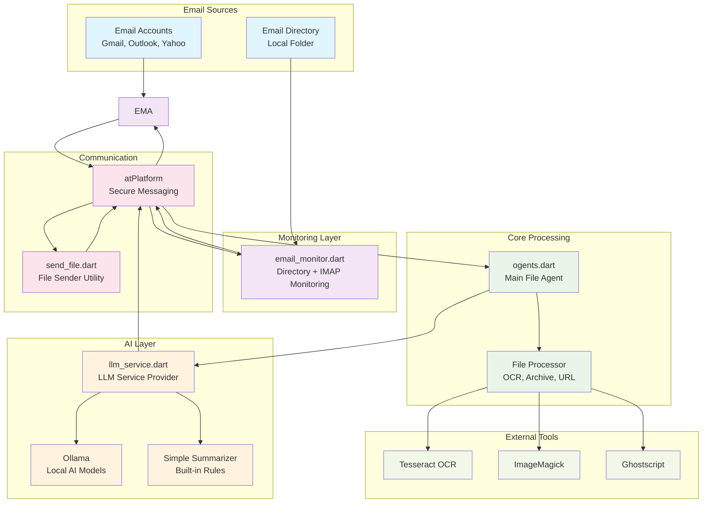

# ogents System Architecture and Binary Guide

This document provides a comprehensive overview of all the binaries in the ogents system and how they work together.

## System Architecture



## Binary Components

### 1. `ogents.dart` - Main File Agent
**Purpose**: Core file processing agent that handles atPlatform notifications
**Location**: `bin/ogents.dart`

**Functionality**:
- Listens for file notifications via atPlatform
- Processes various file formats (PDF, images, text, archives)
- Coordinates with LLM service for content analysis
- Handles OCR processing for images and PDFs
- Manages file downloads and URL processing

**Usage**:
```bash
dart run bin/ogents.dart -a @agent_atsign -l @llm_service_atsign -n ogents
```

**Key Arguments**:
- `-a, --atsign`: Your agent's atSign
- `-l, --llm-atsign`: atSign of the LLM service
- `-n, --namespace`: Namespace for communication (default: ogents)
- `-p, --download-path`: Directory for temporary file storage
- `-v, --verbose`: Enable detailed logging

**Dependencies**: File processor, atPlatform client, OCR tools

---

### 2. `email_monitor.dart` - Enhanced Email Monitor
**Purpose**: Advanced email monitoring with both IMAP and directory support
**Location**: `bin/email_monitor.dart`

**Functionality**:
- **IMAP Mode**: Direct connection to email accounts (Gmail, Outlook, Yahoo)
- **Directory Mode**: Monitors local folders for new PDF files
- Size validation (8MB limit) to prevent buffer overflow
- Automatic file archival with timestamps
- Email marking as read after processing
- Support for all major email providers

**Usage**:

**IMAP Mode**:
```bash
dart run bin/email_monitor.dart -a @sender -g @agent -n ogents \
  --imap-server imap.gmail.com \
  --email user@gmail.com \
  --password app_password \
  --ssl
```

**Directory Mode**:
```bash
dart run bin/email_monitor.dart -a @sender -g @agent -n ogents \
  -e ./email_attachments \
  -i 30
```

**Key Arguments**:
- `-a, --atsign`: Sender's atSign
- `-g, --agent`: Target ogents agent atSign
- `-e, --email-dir`: Directory to monitor (directory mode)
- `--imap-server`: IMAP server hostname
- `--email`: Email address for IMAP
- `--password`: Email password (use app passwords for Gmail/Yahoo)
- `--ssl`: Use SSL/TLS (default: true)
- `-i, --poll-interval`: Check interval in seconds

**Dependencies**: atPlatform client, enough_mail package for IMAP

---

### 3. `llm_service.dart` - LLM Service Provider
**Purpose**: AI-powered content analysis and summarization service
**Location**: `bin/llm_service.dart`

**Functionality**:
- **Ollama Integration**: Connects to local Ollama instances
- **Simple Summarizer**: Built-in rule-based analysis
- Processes text content and generates intelligent summaries
- Provides file statistics and key term extraction
- Supports multiple AI models through Ollama

**Usage**:

**With Ollama**:
```bash
dart run bin/llm_service.dart -a @llm_service -n ogents -t ollama \
  --ollama-url http://localhost:11434 \
  --ollama-model llama3.2
```

**Simple Mode**:
```bash
dart run bin/llm_service.dart -a @llm_service -n ogents -t simple
```

**Key Arguments**:
- `-a, --atsign`: LLM service atSign
- `-t, --llm-type`: Type of LLM (simple, ollama)
- `--ollama-url`: Ollama API URL
- `--ollama-model`: Ollama model name

**Dependencies**: Ollama (optional), atPlatform client

---

### 4. `send_file.dart` - File Sender Utility
**Purpose**: Command-line utility for sending files to ogents agents
**Location**: `bin/send_file.dart`

**Functionality**:
- Send local files to ogents agents
- Send URLs for remote file processing
- Direct integration with atPlatform messaging
- Support for all file types handled by ogents

**Usage**:

**Send Local File**:
```bash
dart run bin/send_file.dart -a @sender -g @agent -f /path/to/file.pdf -n ogents
```

**Send URL**:
```bash
dart run bin/send_file.dart -a @sender -g @agent -u https://example.com/doc.pdf -n ogents
```

**Key Arguments**:
- `-a, --atsign`: Sender's atSign
- `-g, --agent`: Target agent atSign
- `-f, --file`: Local file path
- `-u, --url`: URL to process
- `-n, --namespace`: Communication namespace

**Dependencies**: atPlatform client

---

## System Workflow

### 1. Standard File Processing Flow
```
User → send_file.dart → atPlatform → ogents.dart → File Processor → LLM Service → Summary Response
```

### 2. Email Monitoring Flow
```
Email Account → email_monitor.dart → PDF Extraction → atPlatform → ogents.dart → OCR Processing → LLM Analysis → Summary
```

### 3. IMAP Email Flow
```
IMAP Server → email_monitor.dart → PDF Parsing → atPlatform → ogents.dart → Processing → Response
```

## File Processing Capabilities

### Supported Formats
- **PDFs**: Multi-page OCR processing (up to 10 pages)
- **Images**: JPG, PNG, BMP, TIFF, GIF with OCR
- **Text Files**: TXT, MD, LOG, CSV, JSON, XML, YAML
- **Archives**: ZIP, TAR, GZ (extracts and processes contents)
- **URLs**: Any web-accessible file

### OCR Technology Stack
- **Tesseract OCR**: Text extraction engine
- **ImageMagick**: PDF-to-image conversion (300 DPI)
- **Ghostscript**: PDF processing and page counting
- **Native Dart**: No Rust dependencies required

### Size Limits
- **Maximum File Size**: 8MB (prevents atPlatform buffer overflow)
- **PDF Page Limit**: 10 pages for OCR processing
- **Archive Processing**: Extracts and validates individual files

## Email Provider Configuration

### Gmail Setup
```bash
# IMAP Settings
Server: imap.gmail.com
Port: 993 (SSL)
Authentication: App Password required
```

### Outlook Setup
```bash
# IMAP Settings
Server: outlook.office365.com
Port: 993 (SSL)
Authentication: Regular password or app password
```

### Yahoo Setup
```bash
# IMAP Settings
Server: imap.mail.yahoo.com
Port: 993 (SSL)
Authentication: App Password required
```

## Development and Testing

### Testing Utilities Location
All testing utilities are located in `tools/testing/`:

- `create_test_pdf.dart`: Generate test PDF files
- `debug_ocr.dart`: OCR debugging and validation
- `test_file_processor.dart`: File processing tests
- `test_pdf_conversion.dart`: PDF conversion testing
- `verify_setup.dart`: System dependency verification

### Example Test Data
Sample files for testing are in `tools/testing/test_data/`:
- `PDF_TestPage.pdf`: Standard test PDF
- `test_document.pdf`: Multi-page test document

## Security Features

### atPlatform Security
- **End-to-End Encryption**: All communications encrypted
- **Authentication**: atSign-based identity verification
- **No Central Servers**: Decentralized architecture
- **Private Keys**: Local key storage and management

### File Handling Security
- **Size Validation**: Prevents buffer overflow attacks
- **Temporary Storage**: Automatic cleanup of processed files
- **Sandboxed Processing**: OCR tools run in isolated environment

## Error Handling and Monitoring

### Common Issues and Solutions

**Email Connection Issues**:
- Verify IMAP server settings
- Use app passwords for Gmail/Yahoo
- Check firewall and network settings

**OCR Processing Errors**:
- Ensure Tesseract, ImageMagick, and Ghostscript are installed
- Verify file permissions and temporary directory access
- Check file size limits (8MB maximum)

**atPlatform Communication Issues**:
- Verify atSign keys and authentication
- Check namespace configuration
- Ensure network connectivity to atPlatform servers

### Logging and Debugging
- Use `-v` or `--verbose` flags for detailed logging
- Check system logs for OCR tool errors
- Monitor file processing in download directories

## Performance Considerations

### Optimization Settings
- **Poll Intervals**: Adjust email checking frequency (default: 60s)
- **File Size Limits**: 8MB maximum to prevent memory issues
- **Concurrent Processing**: Single-threaded to ensure stability
- **Temporary Cleanup**: Automatic removal of processed files

### Resource Requirements
- **Memory**: 256MB minimum for basic operation
- **Storage**: Temporary space for file processing
- **Network**: Stable connection for atPlatform communication
- **CPU**: OCR processing is CPU-intensive for large PDFs

## Integration Examples

### Complete System Setup
```bash
# 1. Start LLM Service
dart run bin/llm_service.dart -a @llm -n ogents -t ollama \
  --ollama-url http://localhost:11434 --ollama-model llama3.2

# 2. Start File Agent
dart run bin/ogents.dart -a @agent -l @llm -n ogents

# 3. Start Email Monitoring
dart run bin/email_monitor.dart -a @sender -g @agent -n ogents \
  --imap-server imap.gmail.com --email user@gmail.com --password app_pass --ssl

# 4. Send Test File
dart run bin/send_file.dart -a @user -g @agent -f document.pdf -n ogents
```

This creates a complete automated document processing pipeline with email monitoring, OCR capabilities, and AI-powered summarization.
