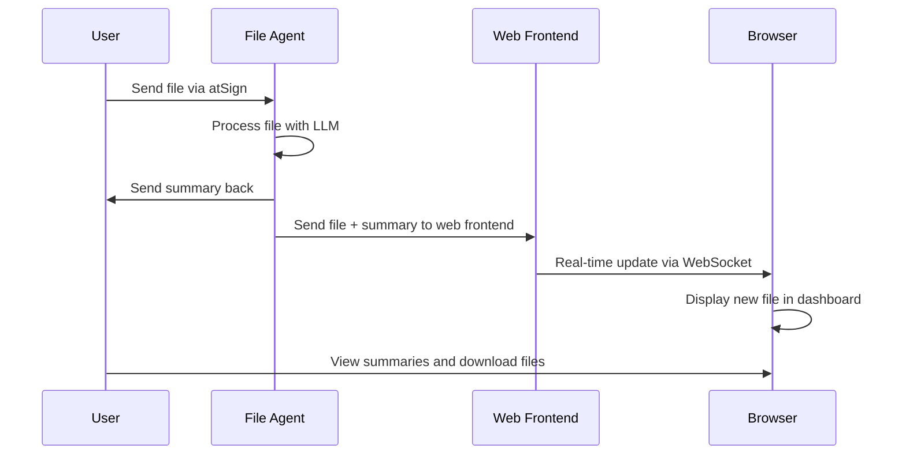

# ogents Web Frontend

A secure, local web interface for viewing processed files and summaries from the ogents system.

## Features

- **Real-time Dashboard**: Live updates when files are processed
- **Secure Access**: Only accessible with valid atSign authentication
- **File Management**: View summaries and download original PDFs
- **Responsive Design**: Works on desktop and mobile devices
- **WebSocket Updates**: Instant notifications of new processed files

## Quick Start

1. **Start the web frontend**:
   ```bash
   dart run bin/web_frontend.dart --atsign @your_atsign --key-file /path/to/keys/@your_atsign_key.atKeys
   ```

2. **Optional Parameters**:
   ```bash
   dart run bin/web_frontend.dart \
     --atsign @your_atsign \
     --key-file /path/to/keys/@your_atsign_key.atKeys \
     --port 8090 \
     --namespace your_namespace
   ```

3. **Open your browser**:
   ```
   http://localhost:8090
   ```

## How It Works



## Integration with File Processing

The web frontend automatically receives notifications when the file agent processes files:

1. **File Agent Processing**: When a file is processed by `file_agent.dart`, it sends two notifications:
   - Original summary back to the file sender
   - File data + summary to the web frontend

2. **Real-time Updates**: The web frontend listens for `web_frontend_data` notifications and immediately updates the dashboard

3. **File Storage**: Original file data is stored (base64 encoded) for download capabilities

## Dashboard Features

- **File List**: Shows all processed files with timestamps
- **Summary Display**: Click files to view LLM-generated summaries
- **Download**: Download original PDF files
- **Statistics**: Total files processed and recent activity
- **Search**: Filter files by name or content
- **Responsive**: Works on all device sizes

## Security

- **atSign Authentication**: Only users with valid atSign keys can access
- **Local Only**: Web server runs locally, no external access
- **Encrypted**: File data is transmitted via encrypted atPlatform notifications
- **No External Dependencies**: Runs completely offline after initial setup

## Command Line Options

| Option | Description | Default |
|--------|-------------|---------|
| `--atsign` | Your atSign (required) | - |
| `--key-file` | Path to atSign keys file (required) | - |
| `--port` | Web server port | 8090 |
| `--namespace` | atPlatform namespace | ogents |
| `--root-domain` | atServer root domain | root.atsign.org |
| `--storage-dir` | Local storage directory | Auto-generated |
| `--verbose` | Enable verbose logging | false |
| `--help` | Show help message | - |

## File Types Supported

The web frontend can display summaries for any file type that the file agent can process:

- **PDF Documents**: Full text extraction and summarization
- **Text Files**: Direct content summarization
- **Office Documents**: Word, Excel, PowerPoint (via conversion)
- **Images**: OCR text extraction and description
- **Other**: Any file type supported by your LLM configuration

## Troubleshooting

### Common Issues

1. **"Failed to initialize atClient"**
   - Check your atSign and key file path
   - Ensure you have internet connectivity
   - Verify your atSign keys are valid

2. **"Port already in use"**
   - Use a different port: `--port 8091`
   - Check what's using the port: `lsof -i :8090`

3. **"No files appearing"**
   - Ensure the file agent is running
   - Check both agents use the same namespace
   - Verify file processing is working in the file agent

### Logs and Debugging

- Add `--verbose` flag for detailed logging
- Check the terminal output for connection status
- WebSocket connection status shown in browser console

## Development

The web frontend consists of:

- **`bin/web_frontend.dart`**: Main server application
- **`web/index.html`**: Dashboard interface
- **WebSocket Communication**: Real-time updates
- **atPlatform Integration**: Secure notifications

To modify the interface, edit `web/index.html`. The CSS and JavaScript are embedded for simplicity.
